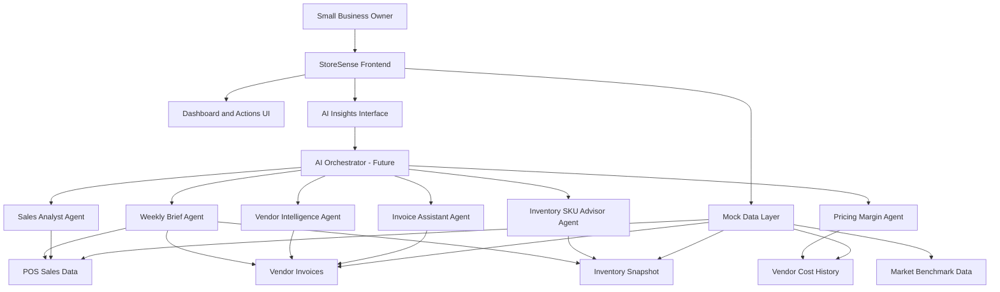
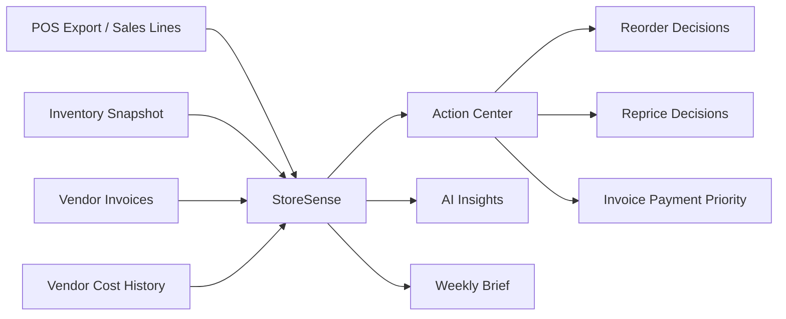
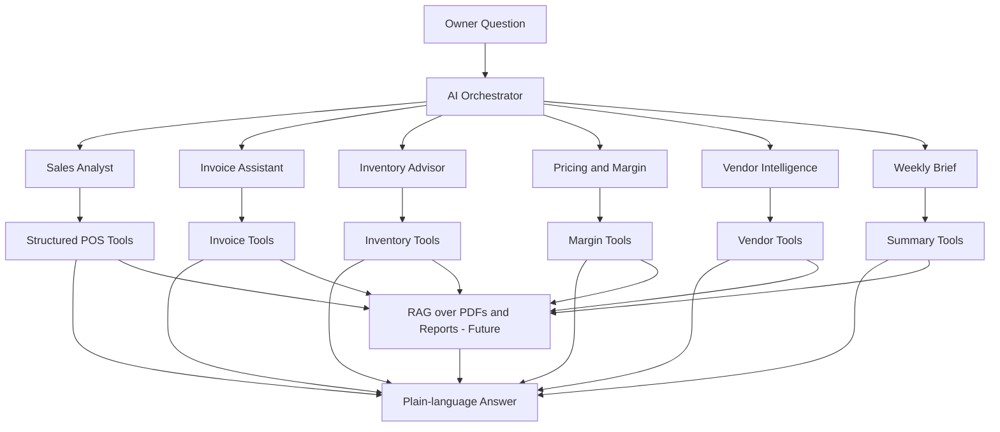

# StoreSense

**AI Profit Leak & Decision Assistant for Small Stores**

[](https://nextjs.org/)
[](https://www.typescriptlang.org/)
[](https://tailwindcss.com/)
[]()
[]()

StoreSense helps small stores turn POS reports, vendor invoices, inventory data, and product-cost history into clear business actions—what to reorder, what to reprice, which invoices to pay, and where profit is leaking.

**Repository:** [StoreSense — AI Profit Leak Assistant for Small Stores](https://github.com/Bijay-Thakur/StoreSense---AI-Profit-Leak-Assistant-for-Small-Stores)

---

## Table of Contents

- [Project Overview](#project-overview)
- [Problem Statement](#problem-statement)
- [Solution](#solution)
- [Key Features](#key-features)
- [AI Strategy](#ai-strategy)
- [Architecture](#architecture)
- [Data Flow](#data-flow)
- [Multi-Agent AI Vision](#multi-agent-ai-vision)
- [Tech Stack](#tech-stack)
- [Project Structure](#project-structure)
- [Mock Data](#mock-data)
- [Getting Started](#getting-started)
- [Deployment](#deployment)
- [Responsive Design](#responsive-design)
- [Security and Data Privacy](#security-and-data-privacy)
- [Roadmap](#roadmap)
- [Team](#team)
- [Why StoreSense Is Different](#why-storesense-is-different)
- [Demo Narrative](#demo-narrative)
- [Status](#status)
- [License](#license)

---

## Project Overview

**StoreSense** is a decision-support product for neighborhood grocery stores, delis, cafes, convenience shops, and specialty food retailers. It is built for owners who run the register and the back office—often without a full-time analyst.

**Who it is for**

- Small-store owners and operators who need weekly clarity on reorders, pricing, and payables  
- Innovators and partners evaluating a pilot (e.g., Queens Chamber of Commerce / Queens Innovator Hub)  
- Technical reviewers who want a credible frontend MVP with a clear path to production AI  

**What it does**

StoreSense reads structured store signals—sales velocity, stock levels, vendor invoices, cost changes, and (in Pro preview) nearby price context—and surfaces **actionable recommendations** in plain language.

**How it complements POS (does not replace it)**

> **StoreSense does not replace POS systems. It turns POS reports and vendor invoices into business actions.**

Systems like MCR POS, Square, Clover, or Shopify POS remain the system of record for checkout, payments, and hardware. StoreSense sits **on top** of POS exports and invoice data as an **AI decision layer**: reorder, reprice, pay bills, match costs to SKUs, and review vendor risk.

**Core message**

| POS systems | StoreSense |
|-------------|------------|
| Show what happened | Help owners decide what to do next |

---

## Problem Statement

Small-business owners face recurring pain that dashboards alone do not solve:

- **Manual decision load** — Reports exist, but owners still decide reorders, prices, and payments by habit and memory.  
- **POS limits** — POS systems capture transactions well but do not always explain *what to do next* when costs shift or stock runs low.  
- **Quiet margin erosion** — Vendor line-item increases are easy to miss until profit has already slipped.  
- **Invoice risk** — Bills can be paid late or missed, hurting supplier relationships and cash flow.  
- **Dead inventory** — Slow-moving SKUs tie up shelf space and working capital.  
- **No analyst on staff** — Most neighborhood stores cannot afford dedicated retail analytics or enterprise BI.

---

## Solution

StoreSense is designed as a **POS-connected decision layer** with several reinforcing capabilities:

| Layer | Role |
|-------|------|
| **Operations dashboard** | Daily KPIs, trends, and top actions at a glance |
| **Action Center** | Single hub for reorder, reprice, invoice, cost-match, and vendor decisions |
| **Invoice & vendor intelligence** | Due dates, urgency, and vendor scorecards |
| **Reorder & pricing guidance** | SKU-level recommendations tied to margin and velocity |
| **AI Insights (MVP)** | Question-and-answer interface over structured mock data |
| **Weekly Owner Brief** | Condensed weekly summary for owner priorities |
| **Market benchmark (Pro preview)** | Illustrative nearby price context for top SKUs |

The current implementation is a **frontend MVP** with **realistic mock data** and **deterministic “AI” responses**—no hosted LLM or live POS API in this repository.

---

## Key Features

| Feature | Route | Business value |
|---------|-------|----------------|
| **Home Dashboard** | `/` | Morning view of sales, profit estimate, low stock, unpaid invoices, top actions, sales trend, and Operations Hub shortcuts. |
| **POS Activity / Sales** | `/sales` | Simulated POS sync: transactions, top sellers, and hourly demand for counter-level confidence. |
| **Action Center** | `/actions` | Central decision hub: reorder, reprice, pay invoices, cost-match review, vendor risk—prioritized with estimated profit impact. |
| **Product Reorder Plan** | `/products` | Weekly buy/skip lists, spend vs impact framing, and product list with insight links. |
| **Product Insight** | `/products/milk-gallon` | Deep SKU view: margin, vendor cost trend, days on hand, and recommended price/reorder actions (profit-leak example). |
| **Vendor Invoices** | `/invoices` | Paid / unpaid / due soon / overdue tracking with vendor links and Cost Match CTA. |
| **Alerts** | `/alerts` | Prioritized issues (low stock, profit leak, invoices) with filters and contextual “take action” links. |
| **Import POS Report** | `/import-pos` | Demo flow for MCR, Square, Clover, Shopify, or CSV—positions StoreSense as a layer on existing POS exports. |
| **Cost Match Center** | `/cost-match` | Match invoice line items to POS products to protect margin accuracy (demo accept/review UX). |
| **Vendor Scorecard** | `/vendors`, `/vendors/[vendorId]` | Vendor health, cost movements, invoice exposure, and recommended vendor actions. |
| **Weekly Owner Brief** | `/weekly-brief` | 60-second executive summary: wins, risks, reorder plan, invoice reminders, and checklist. |
| **Market Price Benchmark** | `/market` | Pro preview: compare your price vs nearby averages plus vendor cost and velocity (demo data). |
| **AI Insights** | `/ai-insights` | Unified assistant with five modes (sales, invoice, inventory, pricing, weekly)—deterministic Q&A over mock data. |
| **Multilingual Owner Assistant** | `/assistant` | Static translated insights (English, Spanish, Bengali, Nepali, Chinese)—demo only, no translation API. |
| **Profile / Plan Selection** | `/profile` | Store profile, Free vs Pro preview (`localStorage`), settings toggles, Advanced Tools links. |
| **Request Pilot Access** | `/pilot` | Pilot waitlist form (client-side success message; no backend submission). |
| **Demo login** | `/login` | `admin` / `admin` sets a demo cookie; full page refresh returns to login for clean demos. |

**Navigation (bottom bar):** Home · Sales · **Actions** (center) · **AI** · Invoices · Alerts

---

## AI Strategy

### Current MVP (honest scope)

- **No OpenAI, Anthropic, or other hosted LLM APIs** in this repo.  
- **No RAG pipeline or vector database** in production yet.  
- **AI Insights** uses `getAIInsightResponse()` in `frontend/src/lib/aiInsightEngine.ts`: keyword and mode-based matching over fixed copy and `storeMetrics`.  
- **Owner Assistant** (`/assistant`) uses static strings per language in `frontend/src/data/assistantResponses.ts`.  
- Answers include **source badges** (e.g., POS Data, Invoice Records) to reinforce data-backed positioning—not generic chat guesses.

### Future hybrid AI architecture

StoreSense is designed to evolve toward a **hybrid** stack:

1. **Structured analytics tools** — Deterministic functions over POS sales, inventory snapshots, invoices, vendor cost history, and reorder tables (fast, auditable numbers).  
2. **RAG** — Retrieval over invoice PDFs, POS export files, weekly briefs, and vendor documents for grounded explanations.  
3. **Multi-agent orchestration** — Specialized agents coordinated by a central router.

**Specialist agents (target production roles)**

| Agent | Primary data |
|-------|----------------|
| **Sales Analyst Agent** | POS sales, daily/hourly summaries |
| **Invoice Assistant Agent** | Vendor invoices, due dates, payment priority |
| **Inventory / SKU Advisor Agent** | Inventory snapshot, reorder recommendations |
| **Pricing & Margin Agent** | Vendor cost history, product margins |
| **Vendor Intelligence Agent** | Vendor scorecards, cost movements |
| **Weekly Brief Agent** | Aggregated KPIs and action lists |

A **central AI orchestrator** routes the owner’s question to the right agent/tool, merges structured results, then narrates the answer in plain language.

---

## Architecture

High-level system view (MVP + future):



**MVP today:** The browser app loads CSV/TypeScript fixtures, renders UI, and simulates AI via `aiInsightEngine.ts`. **Future:** Secure backend, real connectors, LLM tools, and RAG sit behind the same UI patterns.

---

## Data Flow



**Plain-language flow**

- **POS data** tells what sold.  
- **Invoice data** tells what it cost.  
- **StoreSense** combines both—and inventory, alerts, and benchmarks—to recommend **reorder**, **reprice**, **pay**, or **hold** actions.

---

## Multi-Agent AI Vision

Target production routing (GitHub-compatible Mermaid):



| Phase | What runs today | What production adds |
|-------|-----------------|----------------------|
| **Current MVP** | Mock CSV/TS data + **deterministic** `aiInsightEngine.ts` (keyword/mode matching) | — |
| **Future** | Same owner-facing modes | **LLM tool use**, **RAG** over invoices/reports, **secure backend**, real POS/email connectors |

**Current MVP:** One **AI Insights** page (`/ai-insights`) with five mode tabs simulates specialist agents—no hosted model calls. **Future production** can implement real orchestration, agents, and RAG behind the same UI.

---

## Tech Stack

Verified from `frontend/package.json` and source tree:

| Category | Technology |
|----------|------------|
| **Framework** | Next.js 16 (App Router) |
| **UI** | React 19, TypeScript 5 |
| **Styling** | Tailwind CSS 4 |
| **Icons** | Lucide React |
| **Charts** | Custom SVG / CSS bars (no Recharts dependency) |
| **Data** | CSV in `public/mock-data/` + TypeScript loaders in `src/data/` |
| **Demo gate** | Next.js middleware + cookie `storesense_auth` + `/api/auth/login` |
| **Plan state** | `localStorage` (`storesense_plan`) for Free/Pro preview |

**Not used in this repo:** Supabase, Firebase, Stripe, OpenAI API, LangChain, production databases, live POS SDKs, Gmail/OCR pipelines, or environment-variable secrets for core demo flows.

---

## Project Structure

```
LAGCC/
├── README.md                 # This file
├── docs/
│   └── BUILD_TRACKER.md      # Internal feature/build checklist
└── frontend/                 # Next.js application
    ├── app/                  # App Router pages and UI components
    │   ├── actions/
    │   ├── ai-insights/
    │   ├── alerts/
    │   ├── api/auth/login/   # Demo login API route
    │   ├── assistant/
    │   ├── components/       # Shared UI (shell, cards, charts, CTAs)
    │   ├── cost-match/
    │   ├── import-pos/
    │   ├── invoices/
    │   ├── market/
    │   ├── pilot/
    │   ├── products/
    │   ├── profile/
    │   ├── sales/
    │   ├── vendors/
    │   ├── weekly-brief/
    │   ├── login/
    │   ├── layout.tsx
    │   └── page.tsx          # Home dashboard
    ├── public/
    │   ├── mock-data/        # CSV datasets
    │   └── products/         # Product SVG assets
    ├── src/
    │   ├── data/             # Loaders, types, mock fixtures
    │   ├── lib/              # plan.ts, aiInsightEngine.ts
    │   └── hooks/            # usePlan, etc.
    ├── middleware.ts           # Demo auth redirect
    ├── package.json
    └── next.config.mjs
```

---

## Mock Data

The MVP is powered by **realistic static data** so the product can be demonstrated without real POS credentials or private business data.

**Data categories**

- Products (catalog, margin, stock)  
- POS sales lines (activity and totals)  
- Inventory snapshots (on-hand, velocity)  
- Vendor invoices (status, due dates, amounts)  
- Vendor cost history (margin / profit-leak trends)  
- Reorder recommendations (buy vs skip)  
- Alerts (low stock, invoices, profit leaks)  
- Market benchmark data (Pro preview, demo Queens context)  
- AI insight responses (deterministic copy in `aiInsightEngine.ts`)  

**CSV files** under `frontend/public/mock-data/` (loaded via `frontend/src/data/loaders.ts`):

| File | Purpose |
|------|---------|
| `products.csv` | Product catalog, margins, stock |
| `pos_sales_lines.csv` | POS activity / line-level sales |
| `daily_sales_summary.csv` | Dashboard trends |
| `hourly_sales_summary.csv` | Hourly sales bars |
| `inventory_snapshot.csv` | Stock and velocity |
| `reorder_recommendations.csv` | Reorder / do-not-reorder actions |
| `vendor_invoices.csv` | Invoice headers and status |
| `vendor_invoice_lines.csv` | Line items for cost match |
| `vendor_cost_history.csv` | Cost trends (e.g., Milk profit leak) |
| `alerts.csv` | Alert feed |
| `dashboard_kpis.csv` | Home KPI tiles |

Additional TypeScript fixtures: `marketBenchmarks.ts`, `actionCenter.ts`, `vendors.ts`, `weeklyBrief.ts`, `aiInsights.ts`, `assistantResponses.ts`, `storeProfile.ts`, and related modules.

The MVP uses **realistic mock data** so demos work without real POS credentials or private store data. UI copy labels benchmark and market figures as **demo / simulated** where appropriate.

---

## Getting Started

### Prerequisites

- **Node.js** (LTS recommended)  
- **npm**

### Install and run

```bash
cd frontend
npm install
npm run dev
```

Open **http://localhost:3000**

**Demo login:** username `admin`, password `admin`

Optional Turbopack dev server:

```bash
npm run dev:turbo
```

No `.env` file is required for the mock-data MVP.

### Production build

```bash
cd frontend
npm run build
npm start
```

### Lint

```bash
cd frontend
npm run lint
```

Internal QA notes: `docs/BUILD_TRACKER.md`

---

## Deployment

StoreSense is **frontend-focused** and can be deployed to **[Vercel](https://vercel.com)** (or any Node host that supports Next.js).

1. Set the Vercel project root to **`frontend/`** (or deploy from that directory).  
2. Confirm the production build passes locally before deploying.  
3. **No production secrets** are required for the mock-data MVP.  
4. Future POS, email, LLM, and database integrations will need a backend and environment variables—not in this prototype.

```bash
cd frontend
npm install
npm run build
```

On Vercel, use **Install Command:** `npm install`, **Build Command:** `npm run build`, **Output:** Next.js default. Optional **Start Command:** `npm start` for non-Vercel Node hosts.

---

## Responsive Design

The UI is **mobile-first**:

- Bottom navigation optimized for phone counters  
- Centered **max-width** layout on desktop (readable “store tablet” feel)  
- **Card-based** sections, grids, and touch-friendly controls  
- Sales trend and benchmark charts use **responsive SVG/CSS** (full-width on small screens)

Target devices: phone, tablet, and desktop browser.

---

## Security and Data Privacy

### Current MVP

| Topic | Status |
|-------|--------|
| Customer / store data | **Mock / simulated only** — no real business records |
| Payments / billing | **None** (Pro plan is a UI preview only) |
| Authentication | **Demo only** — `admin` / `admin` cookie via middleware; not production user accounts |
| External AI APIs | **None** (no OpenAI or hosted LLM) |
| External POS / Gmail / OCR APIs | **None** |
| Third-party database | **None** |

### Future production considerations

- Secure POS and inventory connectors (OAuth/API keys, least privilege)  
- OAuth for Gmail/Outlook invoice ingestion  
- Role-based access (owner, manager, accountant)  
- Encrypted storage for invoices and cost history  
- Audit logs for price and reorder decisions  
- Secrets via environment variables and rotated credentials  

---

## Roadmap

### Short-term

- Real **CSV upload** for POS reports (client-side parse)  
- Richer **chart analytics** on sales and margin  
- **Invoice import** prototype (file drop)  
- Editable / snoozed **actions** with local persistence  
- **Export** weekly brief (PDF/print)  
- **Pilot feedback** capture with a real backend endpoint  

### Long-term

- Live **POS integrations** (MCR, Square, Clover, etc.)  
- **Gmail/Outlook** invoice detection  
- **OCR** for supplier PDFs  
- Secure **backend + database** (multi-tenant)  
- **Hosted LLM** with tool use and **RAG** over invoices and reports  
- **Multi-store** and franchise views  
- **Business analyst portal** for pilot partners  
- **Queens, NY** local market benchmark pilot with verified data provenance  

---

## Team

| Team Member | Role |
|-------------|------|
| Alif Rony | Full Stack Developer, Presenter |
| Joji Kashimura | Full Stack Developer, QA Analyst |
| Lhakpa Kanchhi Sherpa | Project Manager, Full Stack Developer |
| Bijay Thakur | AI Engineer, Data Analyst |

---

## Why StoreSense Is Different

Most POS systems help owners **record transactions**. StoreSense helps owners **understand what actions to take next**.

StoreSense is **not** trying to become another register or checkout system. It is an **intelligence layer** that:

- Accepts **POS exports** and **vendor invoices** owners already have  
- Surfaces **prioritized actions** (reorder, reprice, pay, match costs, skip slow SKUs)  
- Explains **why** in plain language (AI Insights + weekly brief)  
- Respects that owners use **existing POS brands** (e.g., MCR POS) day to day  

---

## Demo Narrative

**Story arc (owner journey)**

- Owner checks the **daily dashboard** (sales, profit estimate, low stock, invoices).  
- **POS data** (simulated) updates sales and inventory context on **Sales** and Home.  
- StoreSense surfaces **low stock** and **profit leaks** (e.g., Milk margin).  
- **Invoices** are tracked by urgency (due soon, overdue).  
- **Action Center** shows what to reorder, reprice, pay, or review.  
- **AI Insights** explains decisions in natural language with data source badges.  
- **Weekly Owner Brief** summarizes weekly priorities and next steps.  

**Suggested live demo (5–8 minutes)**

1. Sign in (`admin` / `admin`) → **Home**.  
2. **Sales** → POS activity.  
3. **Actions** (center tab) → reorder, reprice, invoice, cost match, vendor cards.  
4. **AI** → *“Which invoices are due soon?”* or *“Should I buy RB-24CT next week?”*  
5. **Invoices** + **Alerts** → urgency and deep links.  
6. **Weekly Owner Brief** (Operations Hub) → executive summary.  
7. **Profile** → Preview **Pro** → **Market Benchmark** (demo).  
8. **Pilot** page → Chamber / innovator follow-up.

---

## Status

This repository is a **post-hackathon MVP / prototype** (hackathon winner) prepared for **validation, demos, and pilot conversations**—including presentations to Queen’s Chamber of Commerce / Queen’s Innovator Hub.

It demonstrates product vision, UX, and technical direction. It is **not** a production SaaS with live integrations, billing, or hosted AI.

---

## License

No license has been added yet.

---

*StoreSense — POS shows what happened. StoreSense helps owners decide what to do next.*
